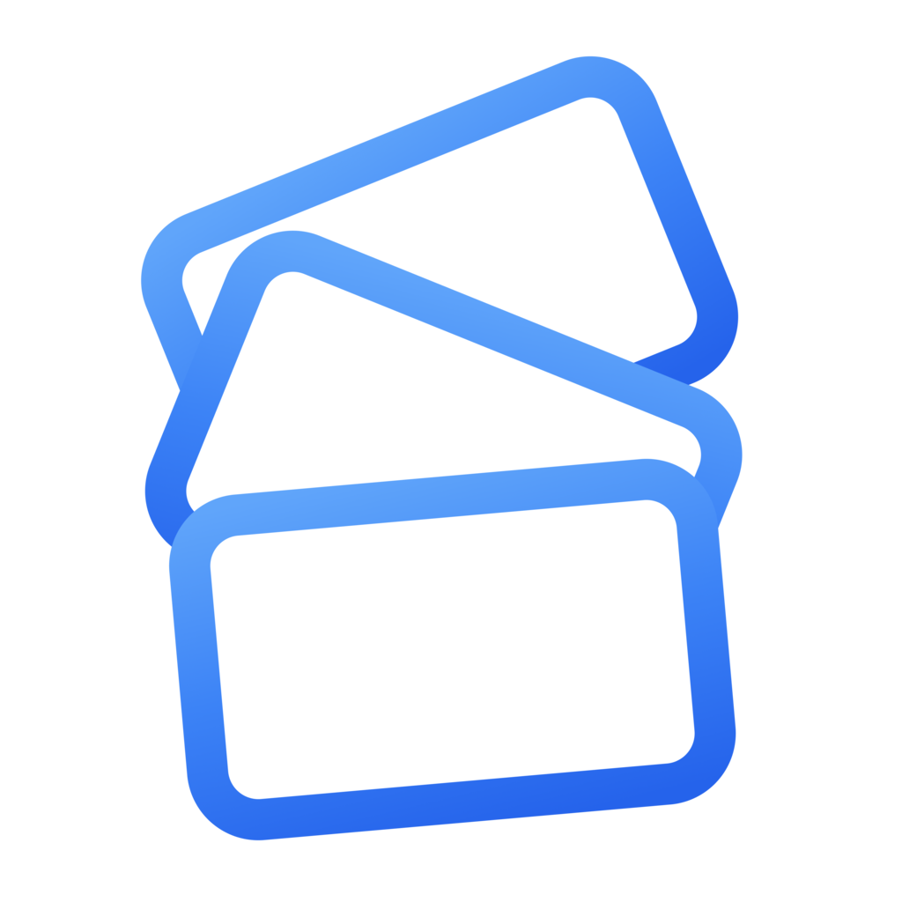
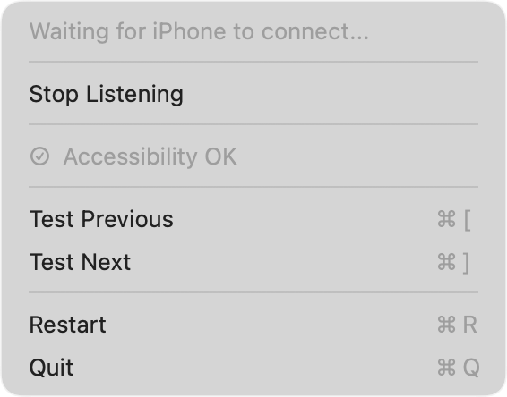
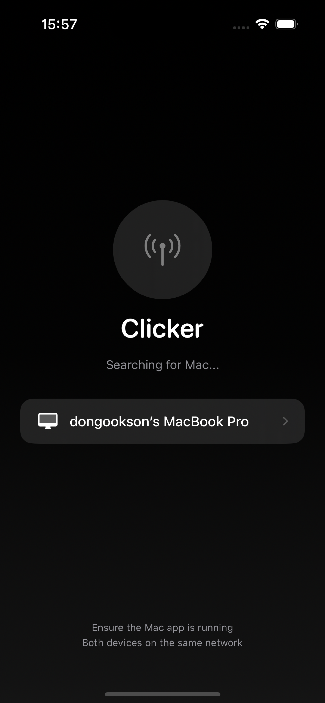
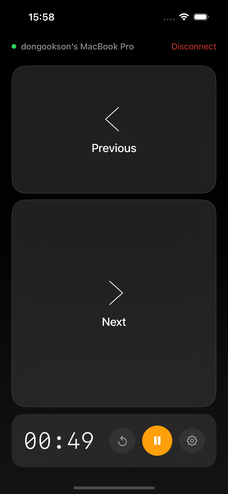
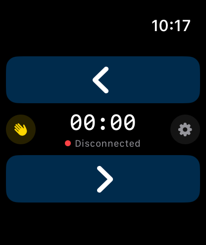
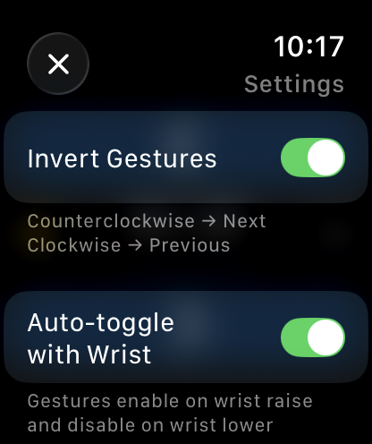
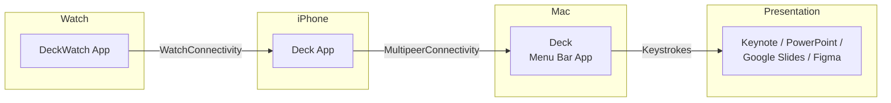
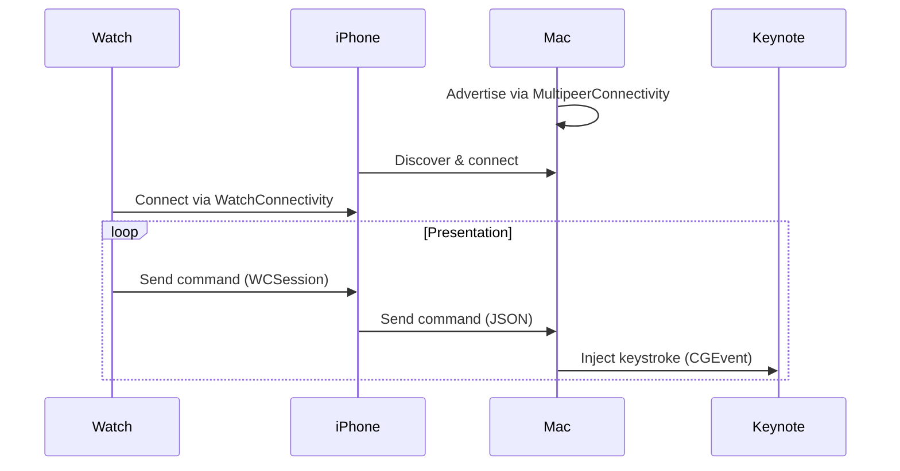

<p align="center">
  
  &nbsp;&nbsp;&nbsp;&nbsp;
  
</p>

<h1 align="center">Deck — Presentation Remote</h1>

<p align="center">
  <strong>Control your presentations from your iPhone — no dongles, no BS.</strong>
</p>

<p align="center">
  <a href="https://apps.apple.com/us/app/deck/id6758130180"></a>
  <a href="https://github.com/douinc/deck/releases"></a>
  <a href="#"></a>
  <a href="LICENSE"></a>
</p>

---

<table align="center">
  <tr>
    <td align="center">
      
      <br><strong>1. Run on Mac</strong>
      <br><sub>Launch Deck</sub>
    </td>
    <td align="center">
      
      <br><strong>2. Run on iPhone</strong>
      <br><sub>Open Deck</sub>
    </td>
    <td align="center">
      
      <br><strong>3. Present!</strong>
      <br><sub>Tap to navigate slides</sub>
    </td>
  </tr>
</table>

---

### Demo

<p align="center">
  <video src="https://github.com/user-attachments/assets/12147d35-1fa7-46c0-87b8-37b0d127422b" controls width="600"></video>
</p>

---

### Apple Watch

<table align="center">
  <tr>
    <td align="center">
      
      <br><sub>Gesture Enabled</sub>
    </td>
    <td align="center">
      
      <br><sub>Settings</sub>
    </td>
  </tr>
</table>

---

## Why Deck?

Carrying a $30–$100 deck alongside your $1000 iPhone and $2000 Mac seems excessive.

Deck turns your iPhone into a wireless presentation remote. It works with **any app that uses arrow keys** — Keynote, PowerPoint, Google Slides, Figma, and more.
- **No cloud servers** — Direct peer-to-peer connection
- **No accounts** — Just install and go
- **No internet needed** — Works completely offline

---

## How It Works



---

## Installation

### Step 1: Install Mac App (Required)

The Mac app runs in your menu bar and receives commands from your iPhone.

**Option A: Homebrew (Recommended)**
```bash
brew tap douinc/tap
brew install --cask deck
```
> If Homebrew reports an untrusted tap, run `brew trust douinc/tap` once, then re-run the install.

**Option B: Download DMG**

Download from [GitHub Releases](https://github.com/douinc/deck/releases), open the DMG, and drag to Applications.

> **First launch:** Grant Accessibility permission when prompted (System Settings → Privacy & Security → Accessibility), then restart the app via **Debug → Restart App** in the menu bar

### Step 2: Install iPhone App

Download **Deck** from the [App Store](https://apps.apple.com/us/app/deck/id6758130180)

- 7-day free trial included
- $19.99/year subscription

---

## Features

| Feature | Description |
|---------|-------------|
| **Large Touch Targets** | Easy-to-hit buttons designed for stage use |
| **Apple Watch** | Control slides from your wrist with tap buttons, Digital Crown, or double-tap gesture |
| **Digital Crown** | Rotate the crown to navigate slides — clockwise for next, counterclockwise for previous |
| **Live Activities** | See your timer on the Lock Screen and Dynamic Island without opening the app |
| **Presentation Timer** | Track time with haptic alerts at custom intervals |
| **Always-On Display** | Screen stays on while presenting — no connection drops |
| **Dark Mode** | Stage-friendly liquid glass aesthetic |
| **Visual Progress** | Color-coded timer bar (green → yellow → orange → red) |
| **Duration Presets** | 5, 10, 15, 20, 30 minutes or unlimited |
| **Haptic Feedback** | Vibrate every 30s, 1m, 2m, or 5m |
| **Wrist Flick Navigation** | Flick your wrist to navigate slides hands-free, with optional "No Going Back" mode for forward-only control |
| **Double-Tap Gesture** | Hands-free next slide on Apple Watch Series 9+ / Ultra 2 (watchOS 11+) |
| **Stays Active** | Extended runtime session keeps Watch app visible during presentations |

---

## Quick Start

1. **Launch the Mac app** → Look for the icon in your menu bar
2. **Grant Accessibility** → Required for sending keystrokes
3. **Open the iPhone app** → It auto-discovers your Mac
4. **Tap to connect** → Select your Mac from the list
5. **Present!** → Tap the arrows to navigate slides
6. If iPhone cannot connect to your Mac, Check Airplay and Connectivity in Settings. Make sure to set Airplay Automatically to "Automatic".

---

## Privacy

Your presentations stay private:

- **No accounts** — No sign-up required
- **No cloud** — All communication is peer-to-peer
- **No analytics** — We don't track you
- **No data collection** — Nothing leaves your devices

See our [Privacy Policy](PRIVACY_POLICY.md).

---

## Troubleshooting

| Issue | Solution |
|-------|----------|
| Mac not appearing | Ensure both devices are on the same WiFi network |
| Keystrokes not working | Grant Accessibility in System Settings → Privacy & Security, then restart via Debug → Restart App |
| Connection drops | Check that no firewall/VPN blocks local network |

---

## Build from Source

<details>
<summary>Click to expand developer instructions</summary>

### Prerequisites

- macOS 14.0+ (Sonoma)
- Xcode 16.0+
- [XcodeGen](https://github.com/yonaskolb/XcodeGen): `brew install xcodegen`

### Build

```bash
git clone https://github.com/douinc/deck.git
cd deck
xcodegen generate
xcodebuild -scheme DeckMac -configuration Release build
```

### Project Structure

```
deck/
├── project.yml          # XcodeGen configuration
├── justfile             # Build automation
├── Shared/              # Shared code (RemoteCommand)
├── MacApp/              # macOS menu bar app
├── iPhoneApp/           # iOS remote control app
└── WatchApp/            # watchOS companion app
```

### Architecture



</details>

---

## Contributing

Contributions welcome! Fork, create a branch, and open a PR.

---

## License

MIT License — see [LICENSE](LICENSE).

---

<p align="center">
  Made with ❤️ by <a href="https://github.com/douinc">DOU Inc.</a>
</p>
