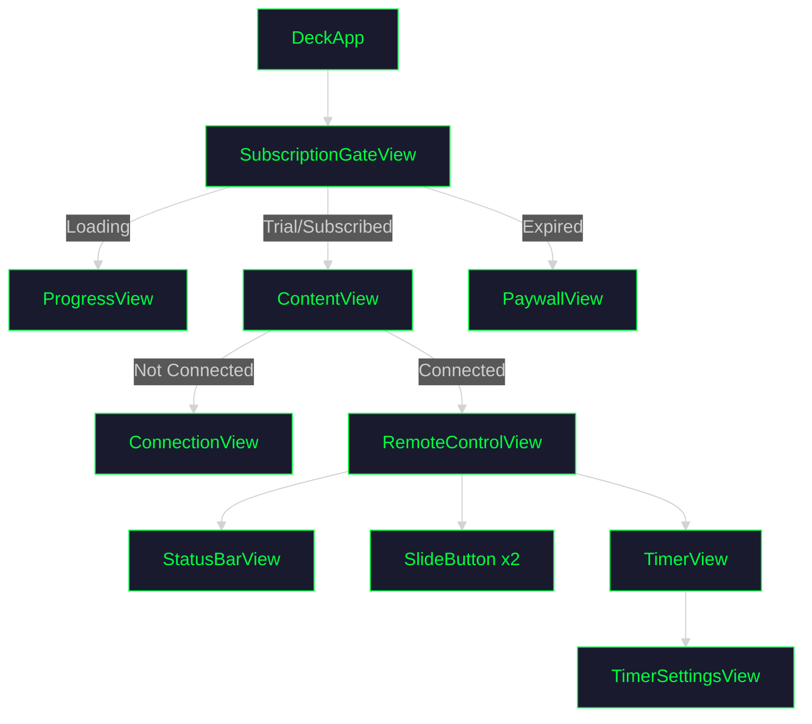

# Architecture

Deck uses a peer-to-peer architecture over Apple's MultipeerConnectivity framework, with Apple Watch support via WatchConnectivity.

## System Overview

```mermaid
%%{init: {'theme': 'dark'}}%%
flowchart TB
    subgraph Watch["Apple Watch App"]
        WUI[SwiftUI Views]
        WCM[WatchConnectionManager]
        WCS[WCSession]
    end

    subgraph iPhone["iPhone App"]
        UI[SwiftUI Views]
        ICM[iPhoneConnectionManager]
        Browser[MCNearbyServiceBrowser]
        Timer[PresentationTimer]
        Sub[SubscriptionManager]
    end

    subgraph Mac["Mac App"]
        MenuBar[MenuBarExtra]
        MCM[MacConnectionManager]
        Advertiser[MCNearbyServiceAdvertiser]
        KS[KeystrokeSender]
        CGE[CGEvent API]
    end

    subgraph Target["Presentation App"]
        Keynote[Keynote / PowerPoint / etc.]
    end

    WUI --> WCM
    WCM --> WCS
    WCS <-->|WatchConnectivity| ICM
    UI --> ICM
    UI --> Timer
    UI --> Sub
    ICM --> Browser
    Browser <-->|MultipeerConnectivity| Advertiser
    Advertiser --> MCM
    MCM --> KS
    KS --> CGE
    CGE --> Keynote

    classDef default fill:#1a1a2e,stroke:#00ff41,color:#00ff41
    classDef subgraphStyle fill:#0d0d1a,stroke:#00ff41
```



## Communication Protocol

### Service Discovery

Both apps use the same service type:

```swift
let serviceType = "clickerremote"
// Resolves to _clickerremote._tcp and _clickerremote._udp
```

- **Mac**: Advertises using `MCNearbyServiceAdvertiser`
- **iPhone**: Browses using `MCNearbyServiceBrowser`

### Message Format

Commands are JSON-encoded `RemoteCommand` values:

```swift
// Shared/RemoteCommand.swift
enum RemoteCommand: String, Codable {
    case nextSlide = "next"
    case previousSlide = "previous"
    case startPresentation = "start"
    case endPresentation = "end"
    case blackScreen = "black"
    case keepalive = "keepalive"
}
```

### Connection Sequence

```mermaid
%%{init: {'theme': 'dark'}}%%
sequenceDiagram
    participant iPhone
    participant Mac
    participant Keynote

    Note over Mac: App launches
    Mac->>Mac: Start MCNearbyServiceAdvertiser

    Note over iPhone: App launches
    iPhone->>iPhone: Start MCNearbyServiceBrowser
    iPhone->>Mac: Discover advertised service
    iPhone->>Mac: Send invitation to connect
    Mac->>iPhone: Accept invitation
    Note over iPhone,Mac: MCSession established

    loop User interaction
        iPhone->>Mac: Send RemoteCommand (JSON)
        Mac->>Mac: Decode command
        Mac->>Keynote: Inject keystroke via CGEvent
    end

    iPhone->>Mac: Disconnect
    Note over Mac: Return to advertising

    classDef default fill:#1a1a2e,stroke:#00ff41,color:#00ff41
```

## Mac App Architecture

### Menu Bar Integration

The Mac app runs entirely in the menu bar using `MenuBarExtra`:

```swift
@main
struct DeckMacApp: App {
    var body: some Scene {
        MenuBarExtra("Deck", systemImage: "rectangle.inset.filled.and.cursorarrow") {
            ContentView()
        }
        .menuBarExtraStyle(.window)
    }
}
```

`LSUIElement: true` in Info.plist prevents showing a Dock icon.

### Keystroke Injection

`KeystrokeSender` uses Core Graphics `CGEvent` API:

```swift
func sendKeystroke(_ keyCode: UInt16) {
    let source = CGEventSource(stateID: .hidSystemState)

    // Key down
    let keyDown = CGEvent(keyboardEventSource: source, virtualKey: keyCode, keyDown: true)
    keyDown?.post(tap: .cghidEventTap)

    // Key up
    let keyUp = CGEvent(keyboardEventSource: source, virtualKey: keyCode, keyDown: false)
    keyUp?.post(tap: .cghidEventTap)
}
```

⚠️ **Requires Accessibility permission** in System Settings → Privacy & Security → Accessibility.

### Key Mappings

| Command | Key Code | Key |
|---------|----------|-----|
| Next Slide | 124 | → (Right Arrow) |
| Previous Slide | 123 | ← (Left Arrow) |
| Start Presentation | 36 | Return |
| End Presentation | 53 | Escape |
| Black Screen | 11 | B key |
| Keepalive | — | No keystroke |

## Apple Watch Architecture

### Communication Model

The Watch app communicates with the Mac **through the iPhone** as a relay:

```
Watch → (WatchConnectivity) → iPhone → (MultipeerConnectivity) → Mac
```

### WatchConnectivity

The Watch uses `WCSession.sendMessage` for real-time command relay:

```swift
// Watch sends command to iPhone
session.sendMessage(["command": "next"], replyHandler: { reply in
    // iPhone replies with Mac connection status
    if let connected = reply["connectedToMac"] as? Bool {
        self.isConnectedToMac = connected
    }
})
```

The iPhone relays commands to the Mac and sends connection status back to the Watch via `updateApplicationContext`.

### Gesture Detection (Flick Mode)

The Watch uses CoreMotion's gyroscope to detect wrist flick gestures:

```swift
// GestureManager.swift — processMotion()
let rotationX = motion.rotationRate.x   // Wrist flexion/extension axis
guard abs(rotationX) > rotationThreshold else { return }  // 3.0 rad/s threshold

let gesture: DetectedGesture = (rotationX > 0) != isInverted ? .next : .previous

// "No Going Back" — skip backward gestures entirely
if gesture == .previous && self.noGoingBack { return }
```

**Settings** (persisted via UserDefaults):

| Setting | Key | Default | Description |
|---------|-----|---------|-------------|
| Gesture Lock | `gestureLockEnabled` | `false` | 3-second cooldown after each gesture |
| Invert Gestures | `gestureInverted` | `false` | Swap forward/backward flick directions |
| Auto-toggle with Wrist | `gestureAutoToggle` | `false` | Enable on wrist raise, disable on wrist lower |
| No Going Back | `gestureNoGoingBack` | `false` | Ignore backward flick gestures (forward-only) |

When "No Going Back" is enabled, the previous-slide button in the UI is also disabled and dimmed to provide visual feedback.

### Always-On Display

When connected, the iPhone disables the idle timer to prevent the screen from locking:

```swift
// RemoteControlView
.onAppear {
    UIApplication.shared.isIdleTimerDisabled = true
}
.onDisappear {
    UIApplication.shared.isIdleTimerDisabled = false
}
```

This keeps the MultipeerConnectivity session alive, which in turn keeps the Watch connected. Without this, iOS suspends the app on screen lock and the MC session drops.

### Watch Timer

The Watch has its own independent presentation timer with:

- **Tap** to start/stop
- **Long press** to reset (with haptic feedback via `WKInterfaceDevice.current().play(.notification)`)

---

## iPhone App Architecture

### View Hierarchy



### State Management

| State | Type | Scope |
|-------|------|-------|
| Connection | `@StateObject` + `ObservableObject` | App-wide |
| Timer | `@StateObject` + `ObservableObject` | App-wide |
| Subscription | `@State` + `@Observable` | Environment |
| UI State | `@State` | Per-view |

### Subscription Flow

```mermaid
%%{init: {'theme': 'dark'}}%%
stateDiagram-v2
    [*] --> NotDetermined: App Launch

    NotDetermined --> Trial: First Launch
    NotDetermined --> Subscribed: Has Entitlement
    NotDetermined --> Expired: Trial Ended

    Trial --> Expired: Day 8+
    Trial --> Subscribed: Purchase

    Expired --> Subscribed: Purchase
    Subscribed --> Expired: Subscription Ends

    classDef default fill:#1a1a2e,stroke:#00ff41,color:#00ff41
```

## Data Persistence

### Trial Tracking (Keychain)

Trial start date is stored in Keychain to survive app reinstallation:

```swift
class TrialTracker {
    private let keychainKey = "com.dou.deck.trial.start"

    func startTrial() {
        // Store start date in Keychain
        // kSecAttrAccessibleAfterFirstUnlock
    }

    var daysRemaining: Int {
        // Calculate from stored start date
    }
}
```

### Subscription (StoreKit 2)

```swift
func checkEntitlements() async {
    for await result in Transaction.currentEntitlements {
        // Verify transaction and extract status
    }
}
```

## Thread Safety

Both apps use `@MainActor` for UI updates:

```swift
@MainActor
class MacConnectionManager: NSObject, ObservableObject {
    @Published var isConnected = false
    // All published properties update on main thread
}
```

MultipeerConnectivity delegates dispatch to main queue by default.
