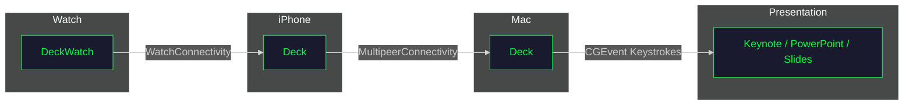

# Deck Developer Wiki

Welcome to the Deck developer documentation. This wiki contains technical documentation for developers who want to build, modify, or contribute to the project.

## Quick Links

| Section | Description |
|---------|-------------|
| [[Getting-Started]] | Set up your development environment |
| [[Architecture]] | System design and component overview |
| [[Building]] | Build commands and distribution |
| [[API-Reference]] | Code structure and key classes |
| [[Contributing]] | How to contribute |
| [[Troubleshooting]] | Common issues and solutions |

## Project Overview

Deck is a presentation remote system consisting of three apps:

- Deck (iOS v1.12) — Remote control app for iPhone
- Deck (macOS v1.12) — Menu bar app that receives commands
- DeckWatch (watchOS v1.12) — Apple Watch companion for wrist-based control



## Tech Stack

| Component | Technology |
|-----------|------------|
| Language | Swift 5.9 |
| UI Framework | SwiftUI |
| Networking | MultipeerConnectivity, WatchConnectivity |
| Build System | XcodeGen + xcodebuild |
| macOS Target | 14.0+ (Sonoma) |
| iOS Target | 18.0+ |
| watchOS Target | 10.0+ |

## Repository Structure

```
deck/
├── project.yml          # XcodeGen configuration
├── justfile             # Build automation
├── Shared/              # Shared code between apps
│   └── RemoteCommand.swift
├── MacApp/              # macOS menu bar app
├── iPhoneApp/           # iOS remote control app
├── WatchApp/            # watchOS companion app
├── wiki/                # GitHub Wiki source
├── public/              # Logos and screenshots
├── build/               # Build artifacts
└── .github/             # GitHub Actions workflows
```

## Distribution

| App | Distribution | Link |
|-----|--------------|------|
| Deck | GitHub Releases (DMG) | [Releases](https://github.com/douinc/deck/releases) |
| Deck | Homebrew Cask | `brew tap douinc/tap && brew install --cask deck` |
| Deck | App Store | [App Store](https://apps.apple.com/us/app/deck/id6758130180) |
| DeckWatch | Bundled with iOS app | Installs automatically via Watch app |

## License

MIT License — see [LICENSE](https://github.com/douinc/deck/blob/main/LICENSE)

---

*Maintained by [DOU Inc.](https://github.com/douinc)*
